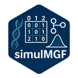

 Package to simulate a random SNP Matrix
for diploid organisms (coded by 0, 1, 2) or half sib/full sib SNP matrix
from real or simulated parents SNP data. Simulate phenotypic traits for
real or simulated SNP data, controlled by a specific number of QTLs and
their effects, sampled from a Normal or a Uniform distributions.

## Installation

You can install the development version of this package directly from
GitHub using either `remotes` or `devtools`.

``` r

# Install the remotes package if you haven't already
if (!requireNamespace("remotes", quietly = TRUE)) {
  install.packages("remotes")
}

# Install this package from GitHub
remotes::install_github("mngar/simulMGF")
```

### Usage

Once installed, load the package into your R environment:

``` r

library(simulMGF)
```
